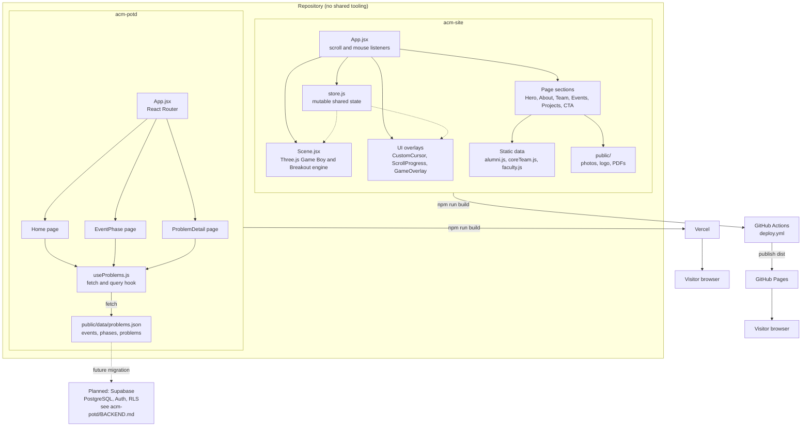

# ACM IGDTUW

Official web presence of the ACM Student Chapter at IGDTUW. This repository is a monorepo-style workspace containing two independent, standalone frontend applications that are each deployed separately.

| Project | Path | Purpose | Deployed to |
|---|---|---|---|
| Club Website | [acm-site/](acm-site) | Public marketing site with an interactive 3D hero (Game Boy + playable Breakout) | GitHub Pages |
| Problem of the Day | [acm-potd/](acm-potd) | Tracks daily coding problems across events and skill phases | Vercel |

There is no shared build system, no shared package.json, and no cross-project imports. Each app has its own dependencies, its own Vite config, and its own deployment pipeline. They are grouped in one repository for convenience only.

---

## Table of Contents

1. [Repository Layout](#repository-layout)
2. [Architecture Diagram](#architecture-diagram)
3. [acm-site: Club Website](#acm-site-club-website)
4. [acm-potd: Problem of the Day](#acm-potd-problem-of-the-day)
5. [Local Development](#local-development)
6. [Deployment](#deployment)
7. [Further Reading](#further-reading)

---

## Repository Layout

```
.
├── .github/workflows/deploy.yml   Deploys acm-site to GitHub Pages on push to main
├── acm-site/                      Club website (React + Three.js + GSAP)
│   ├── DOCS.md                    Full developer documentation for this app
│   ├── public/                    Static assets: team photos, event photos, alumni photos
│   └── src/
│       ├── App.jsx                Root layout, scroll/mouse listeners
│       ├── lib/store.js           Mutable shared state for scroll, mouse, play mode
│       ├── components/
│       │   ├── 3d/Scene.jsx       Entire Three.js world, Game Boy model, Breakout engine
│       │   ├── ui/                CustomCursor, ScrollProgress, GameOverlay
│       │   ├── Navbar.jsx
│       │   ├── HeroFloat.jsx
│       │   └── PixelGridHero.jsx
│       ├── pages/SummerInternship2026.jsx
│       └── data/                  Static data: alumni.js, coreTeam.js, faculty.js
│
├── acm-potd/                      Problem of the Day tracker (React + React Router)
│   ├── BACKEND.md                 Plan for migrating from static JSON to Supabase
│   ├── public/data/problems.json  Source of truth for events, phases, problems
│   ├── vercel.json                SPA rewrite rules for Vercel
│   └── src/
│       ├── App.jsx                Routes: /, /event/:eventId, /event/:eventId/day/:day
│       ├── hooks/useProblems.js   Fetches and queries problems.json
│       ├── pages/                 Home, EventPhase, ProblemDetail
│       └── components/            Navbar, EventSelector, PhaseTabs, ProblemCard, ProblemList
│
└── README.md                      This file
```

---

## Architecture Diagram



---

## acm-site: Club Website

A single-page React app whose centerpiece is a fully custom 3D scene: a Game Boy modeled from raw Three.js primitives (no external model files) with a live, playable Breakout game rendered onto its screen via a canvas texture. The camera moves through six waypoints as the page is scrolled, and a procedural retro/cyberpunk environment (starfield, PCB traces, wireframe monitors, binary rain, cyber grid) fills the background.

Key technologies: React 18, React Three Fiber, Three.js, drei, postprocessing (Bloom, Chromatic Aberration), GSAP with ScrollTrigger, Tailwind CSS, Vite.

State sharing between the DOM and the 3D render loop is done through a plain mutable object in `src/lib/store.js` rather than React state, since the R3F `useFrame` loop runs 60 times per second and React state updates would trigger unnecessary re-renders.

Full breakdown of every component, the game engine, the camera system, lighting, and animation layers is documented in [acm-site/DOCS.md](acm-site/DOCS.md).

## acm-potd: Problem of the Day

A lightweight tracker for the club's daily coding-problem program. Problems are organized by event (for example, "Spring 2026"), by phase (beginner, intermediate, advanced), and by day. Data currently lives in a static file at `public/data/problems.json` and is loaded client-side by `useProblems.js`, which also derives the currently active event and currently active phase based on today's date.

Key technologies: React 19, React Router 7, Tailwind CSS 4, Vite, Vercel Analytics.

Routes:

| Path | Page | Purpose |
|---|---|---|
| `/` | Home | Landing page, links into the active event |
| `/event/:eventId` | EventPhase | Lists problems for an event, tabbed by phase |
| `/event/:eventId/day/:day` | ProblemDetail | Single problem with links to the problem and its solution |

A plan for migrating from the static JSON file to a Supabase-backed admin system (with row level security, an upload UI, and role-based access) is documented in [acm-potd/BACKEND.md](acm-potd/BACKEND.md). No such backend exists yet: this is a forward-looking design document only.

---

## Local Development

Each app is run independently from its own directory.

```bash
# Club website
cd acm-site
npm install
npm run dev

# Problem of the Day tracker
cd acm-potd
npm install
npm run dev
```

`acm-site` also exposes `npm run lint` (ESLint) and `npm run deploy` (manual `gh-pages` publish, normally superseded by the GitHub Actions workflow below).

## Deployment

**acm-site** deploys automatically on every push to `main` via [.github/workflows/deploy.yml](.github/workflows/deploy.yml): it installs dependencies, runs `npm run build` inside `acm-site/`, and publishes the resulting `dist/` directory to GitHub Pages using `peaceiris/actions-gh-pages`.

**acm-potd** deploys to Vercel. `acm-potd/vercel.json` rewrites all paths to `index.html` so client-side routing works correctly on refresh and direct navigation. Build command is `npm run build`, output directory is `dist`, and the Vercel project root is the `acm-potd/` directory.

## Further Reading

- [acm-site/DOCS.md](acm-site/DOCS.md): full developer documentation for the club website, covering every component, the 3D scene, the Breakout game engine, camera system, animation layers, and responsive behavior.
- [acm-potd/BACKEND.md](acm-potd/BACKEND.md): proposed Supabase schema, row level security policies, and admin workflow for moving off the static JSON data source.
